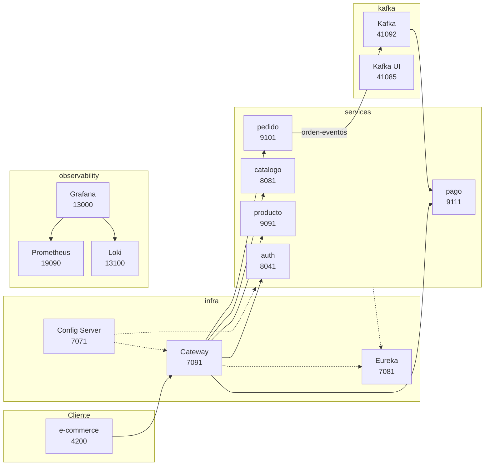

# TechStore - Proyecto MS 2026

Sistema distribuido de comercio electrónico construido con **Spring Cloud**, **Docker** y **Angular**. El proyecto integra infraestructura compartida, microservicios de negocio, mensajería, observabilidad y frontend.

## Producto del proyecto

```text
E-commerce TechStore end-to-end: configurable, escalable, seguro,
resiliente, observable e integrado con frontend Angular.
```

## Arquitectura TechStore



## Estructura del repositorio

```text
infra/           Config Server, Eureka, Gateway, config-repo
kafka/           Broker Kafka, exporter y Kafka UI
observability/   Prometheus, Loki, Promtail, Grafana
services/        auth, catalogo, producto, pedido, pago
e-commerce/      Frontend Angular
docs-site/       Fuente de esta documentación (MkDocs)
```

## Puertos principales (DEV)

| Componente | Puerto |
|---|---:|
| Frontend Angular | 4200 |
| Config Server | 7071 |
| Eureka | 7081 |
| Gateway | 7091 |
| Auth | 8041 |
| Catálogo | 8081 |
| Producto | 9091 |
| Pedido | 9101 |
| Pago | 9111 |
| Kafka | 41092 |
| Kafka UI | 41085 |
| Prometheus | 19090 |
| Grafana | 13000 |

## Inicio rápido

1. Levantar dependencias Docker: `observability`, `kafka` y MySQL de cada servicio.
2. Ejecutar infraestructura: `config-server`, `registry-server`, `gateway`.
3. Ejecutar microservicios en orden.
4. Ejecutar frontend: `ng serve` en `e-commerce/`.
5. Acceder por Gateway: `http://localhost:7091`.

Consulta la guía completa en [Arranque y endpoints](guias/arranque.md).

## Usuarios de prueba

| Usuario | Contraseña | Rol |
|---|---|---|
| admin | admin123 | ADMIN |
| user | user123 | USER |

## Enlaces útiles

- Repositorio: [Deysi123-lab/PROYECTO_TechStore](https://github.com/Deysi123-lab/PROYECTO_TechStore)
- Curso de referencia: [DISTribuidas 2026](https://261dist.github.io/ecom/)
