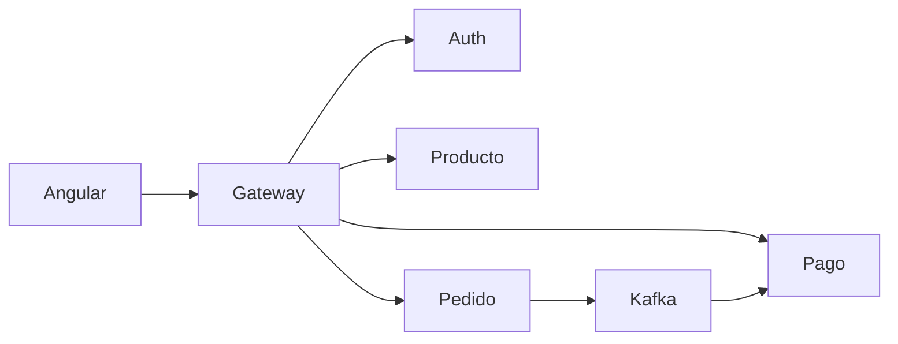

# S15 - Defensa técnica

## 1. Propósito

Sustentar técnicamente TechStore: arquitectura, decisiones, evidencias y aporte individual de cada integrante.

## 2. Preguntas frecuentes del docente

1. ¿Qué parte del producto desarrollaste y cómo se integra con el sistema?
2. ¿Qué evidencia demuestra que tu aporte funciona?
3. ¿Cómo diagnosticarías un fallo en tu componente?

## 3. Arquitectura a presentar

El equipo debe explicar:

- **Infraestructura**: Config Server, Eureka, Gateway
- **Microservicios**: auth, catalogo, producto, pedido, pago
- **Frontend**: Angular consumiendo Gateway
- **Kafka**: eventos pedido → pago
- **Observabilidad**: Prometheus, Loki, Grafana

## 4. Demo sugerida (5 minutos)

1. Mostrar Eureka con servicios registrados.
2. Login desde Angular o PowerShell.
3. Crear pedido y mostrar pago generado.
4. Mostrar Kafka UI o logs del consumer.
5. Mostrar panel de Grafana.

## 5. Aporte individual

Cada integrante debe explicar:

- Módulo trabajado
- Endpoints o pantallas implementadas
- Prueba que demuestra su funcionamiento
- Qué haría si ese componente falla en producción
